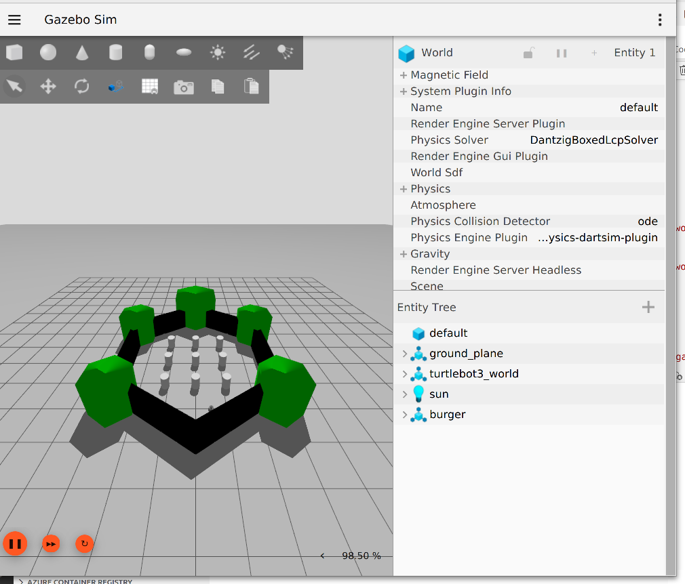

# RosClaw

> [!IMPORTANT]
> **本项目正在进行重大架构重构并向独立仓库迁移。** 请稍后回来看更新，或关注 X [@irvinxyz](https://x.com/irvinxyz) 获取最新进展。

**通过 AI 智能体实现消息应用对 ROS2 机器人的自然语言控制。**

RosClaw 将 [OpenClaw](https://github.com/openclaw) 与 [ROS2](https://docs.ros.org/)（机器人操作系统）通过智能插件层连接。在 Telegram、WhatsApp、Discord 或 Slack 上发送消息 — 机器人就会行动。您可以连接自己的机器人，或"租赁"注册到我们门户的任何机器人。每个机器人都会在门户注册自己的能力和配置信息。

无论是可爱的桌面机器人还是人形机器人，您只需安装我们的 OpenClaw 扩展并运行 ROS2 包即可。


## 工作原理

```
用户 (WhatsApp/Telegram/Discord/Slack)
        |
        v
OpenClaw 网关 (AI 智能体 + 工具 + 记忆)
        |
        v  RosClaw 插件
rosbridge_server (WebSocket)
        |
        v  ROS2 DDS
机器人：Nav2, MoveIt2, 摄像头，传感器
```

1. 用户通过任何消息应用发送自然语言消息
2. OpenClaw 的 AI 智能体接收消息并使用 RosClaw 插件注册的 ROS2 工具
3. 智能体将意图转换为 ROS2 操作（话题发布、服务调用、动作目标）
4. 机器人执行动作，智能体将反馈流式传输回聊天

## 项目结构

```
rosclaw/
├── packages/
│   └── rosbridge-client/         # @rosclaw/rosbridge-client — TypeScript rosbridge WebSocket 客户端
├── extensions/
│   ├── openclaw-plugin/          # @rosclaw/openclaw-plugin — 核心 OpenClaw 扩展
│   └── openclaw-canvas/          # @rosclaw/openclaw-canvas — 实时仪表盘 (Phase 3)
├── ros2_ws/src/
│   ├── rosclaw_discovery/        # ROS2 能力自动发现节点
│   └── rosclaw_msgs/             # 自定义 ROS2 消息/服务定义
├── docker/                       # Docker Compose 配置
└── examples/                     # 演示项目
```

## 快速开始

### 前置条件

- Node.js 20+
- pnpm 9+
- Docker (用于仿真)

### 安装与构建

```sh
pnpm install
pnpm build
```

### 运行演示栈

```sh
cd docker
docker compose up
```

这将启动 ROS2 + rosbridge + Gazebo。然后配置您的 OpenClaw 实例使用 RosClaw 插件，地址为 `ws://localhost:9090`。

### 尝试一下

向您的机器人发送消息：
- **"向前移动 1 米"** — 发布速度到 `/cmd_vel`
- **"导航到厨房"** — 发送 Nav2 目标点
- **"你看到了什么？"** — 捕获摄像头画面
- **"检查电量"** — 读取 `/battery_state`
- **`/estop`** — 紧急停止（绕过 AI）

## 包列表

| 包 | 描述 |
|---|---|
| [`@rosclaw/rosbridge-client`](packages/rosbridge-client/) | 独立的 rosbridge WebSocket 协议 TypeScript 客户端 |
| [`@rosclaw/openclaw-plugin`](extensions/openclaw-plugin/) | OpenClaw 扩展：用于 ROS2 控制的工具、钩子、技能、命令 |
| [`@rosclaw/openclaw-canvas`](extensions/openclaw-canvas/) | 实时机器人仪表盘 (Phase 3) |
| [`rosclaw_discovery`](ros2_ws/src/rosclaw_discovery/) | ROS2 Python 节点，用于能力自动发现 |
| [`rosclaw_msgs`](ros2_ws/src/rosclaw_msgs/) | 自定义 ROS2 消息/服务定义 |

## 智能体工具

AI 智能体可以访问以下 ROS2 工具：

| 工具 | 描述 |
|---|---|
| `ros2_publish` | 发布消息到任何 ROS2 话题 |
| `ros2_subscribe_once` | 读取话题的最新消息 |
| `ros2_service_call` | 调用 ROS2 服务 |
| `ros2_action_goal` | 发送带反馈的动作目标 (Phase 2) |
| `ros2_param_get/set` | 获取/设置 ROS2 节点参数 |
| `ros2_list_topics` | 发现可用的话题 |
| `ros2_camera_snapshot` | 捕获摄像头画面 |

## 开发

```sh
pnpm install          # 安装依赖
pnpm build            # 构建所有包
pnpm typecheck        # 类型检查（不输出文件）
pnpm clean            # 清理构建产物
```

## 许可证

Apache-2.0


```sh
### rosclaw安装依赖及构建
```bash
pnpm install          # 安装依赖
pnpm build            # 构建所有包
```

### 集成 rosclaw插件到openClaw
#### 挂载rosclaw插件到openClaw
##### 本地部署openclaw： 1. 在openClaw的`src/plugins`目录下创建一个软链接，指向rosclaw插件的目录
```bash
ln -s /path/to/rosclaw/packages/rosclaw_plugin src/plugins/
# 例如，如果rosclaw插件位于~/rosclaw/packages/rosclaw_plugin
ln -s ~/rosclaw/packages/rosclaw_plugin src/plugins/
```
##### docker部署openclaw： 1. 在docker-compose.yml中添加一个新的服务，挂载rosclaw插件的目录到openClaw容器内
```yaml
services:
  openclaw:
    # ... 其他配置 ...      
    volumes:
      - ./path/to/rosclaw/packages/rosclaw_plugin:/app/src/plugins/rosclaw_plugin
      # 例如，如果rosclaw插件位于~/rosclaw/packages/rosclaw_plugin
      - ~/rosclaw/packages/rosclaw_plugin:/app/src/plugins/rosclaw_plugin
    ```
####加载rosclaw插件
在openClaw的配置文件中，添加rosclaw插件的加载配置。例如，在
`config/plugins.yaml`中添加：
```yaml
plugins:
    - name: rosclaw_plugin
      type: rosclaw_plugin
      path: /app/src/plugins/rosclaw_plugin
      args: []
``` 
####
重新启动openClaw，使插件生效
```bash
docker compose restart openclaw
``` 
#### 验证rosclaw插件是否加载成功
查看openClaw的日志，确认rosclaw插件已成功加载
```bash
docker compose logs openclaw    
```
##### 失败日志：
2026-03-20T05:50:05.677+00:00 [plugins] plugin service failed (ros2-transport): Error: WebSocket error connecting to ws://ros2:9090
2026-03-20T05:50:07.232+00:00 [ws] Proxy headers detected from untrusted address. Connection will not be treated as local. Configure gateway.trustedProxies to restore local client detection behind your proxy.
2026-03-20T05:50:07.253+00:00 [ws] webchat connected conn=5be36229-7ea4-435c-ad74-fdb21b477e5c remote=127.0.0.1 client=openclaw-control-ui webchat v2026.3.13
2026-03-20T05:50:08.678+00:00 [gateway] ROS2 transport status: connecting
2026-03-20T05:50:08.681+00:00 [gateway] ROS2 transport status: disconnected
2026-03-20T05:50:08.682+00:00 [gateway] ROS2 transport status: disconnected

##### 成功日志：
2026-03-20T05:53:20.741+00:00 [gateway] ROS2 transport status: connected

### 启动ros2环境
```bash
source /opt/ros/humble/setup.bash
source ~/rosclaw/install/setup.bash
``` 

###启动 rosbridge_server
```bash
ros2 launch rosbridge_server rosbridge_server.launch.py
```

### 启动turtlebot3_gazebo
```bash
source /opt/ros/jazzy/setup.bash
ros2 launch turtlebot3_gazebo turtlebot3_world.launch.py
````

#### 启动日志
root@f8fcd141dd84:/ros2_ws# ros2 launch turtlebot3_gazebo turtlebot3_world.launch.py
bash: ros2: command not found
root@f8fcd141dd84:/ros2_ws# source /opt/ros/jazzy/setup.bash 
root@f8fcd141dd84:/ros2_ws# ros2 launch turtlebot3_gazebo turtlebot3_world.launch.py

turtlebot3_gazebo界面



### openClaw webui中测试rosclaw插件
聊天中输入：
1. 请介绍一下你的能力，回复如下类似内容：我是一个rosclaw插件，能够与turtlebot3_gazebo进行通信。


2. 请测试一下你的能力。

输出：

‘’‘
小强，我能帮你控制 TurtleBot3 模拟器，主要能力有：

🚗 移动控制

    发送速度指令（前进、后退、转弯）
    最大线速度 1.0 m/s，角速度 1.5 rad/s

👀 环境感知

    查看摄像头画面（看看机器人前方有什么）
    读取激光雷达数据（检测障碍物）
    获取里程计信息（位置和姿态）

🔋 状态监控

    检查电池电量

⚡ 安全

    你可以随时说 /estop 紧急停止机器人

想先试试哪个功能？比如让它走两步，或者看看摄像头画面？
‘’‘

3. 请控制turtlebot3向前移动，


好的，机器人正在以 0.3 m/s 的速度向前移动！🚗

想让它继续走多久？或者需要我停下来、转弯、还是看看摄像头画面？


 

4.复杂运动：
1.向后运行10M,速度0.1 m/s; 2.检测到障碍物，自动避障；3.当前距离障碍物15cm时，紧急停止。4.每100ms检查一次运行距离和障碍物距离，防止碰撞。5.记录运行轨迹
You 14:23

小强，这个任务比较复杂，需要持续监控传感器数据并实时调整。让我先检查传感器是否正常工作，然后执行这个任务。
小强助手 14:23
Tool 14:23

小强，这个任务比较复杂，需要持续监控传感器数据并实时调整。让我先检查传感器是否正常工作，然后执行这个任务。好的！传感器数据正常。我看到：

    📍 当前位置：x=4.1m
    ⚠️ 激光雷达检测到最近障碍物约 12cm（小于 15cm 安全距离！）

由于已经有障碍物在 15cm 以内，我先执行紧急停止，然后开始向后移动任务。
小强助手 14:23
Tool 14:23

小强，这个任务比较复杂，需要持续监控传感器数据并实时调整。让我先检查传感器是否正常工作，然后执行这个任务。好的！传感器数据正常。我看到：

    📍 当前位置：x=4.1m
    ⚠️ 激光雷达检测到最近障碍物约 12cm（小于 15cm 安全距离！）

由于已经有障碍物在 15cm 以内，我先执行紧急停止，然后开始向后移动任务。⚠️ 紧急停止已执行 - 检测到障碍物距离仅 12cm（小于 15cm 安全阈值）

现在开始执行向后移动 10 米任务。由于需要每 100ms 监控传感器数据，我将创建一个控制脚本来执行：


### 启动 turtlebot3 世界
```bash
ros2 launch turtlebot3_gazebo turtlebot3_world.launch.py
```

```
```sh

```
